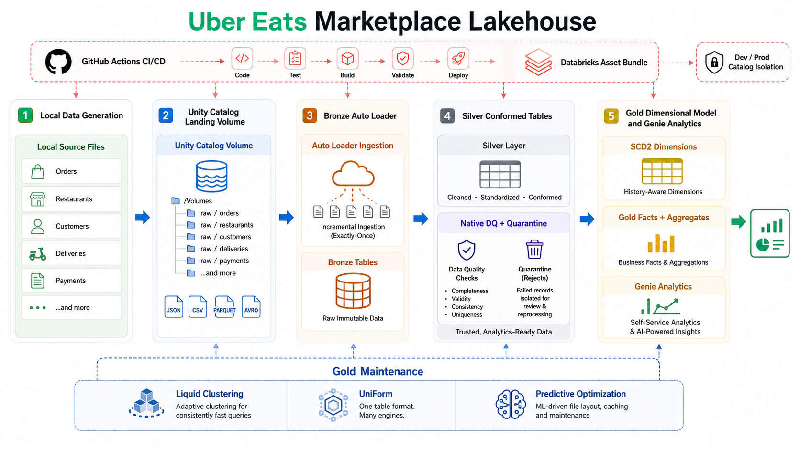
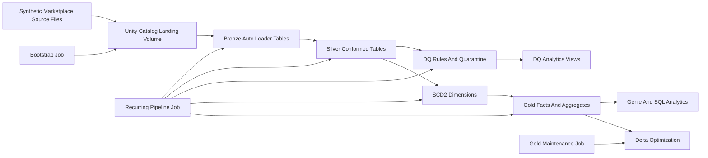
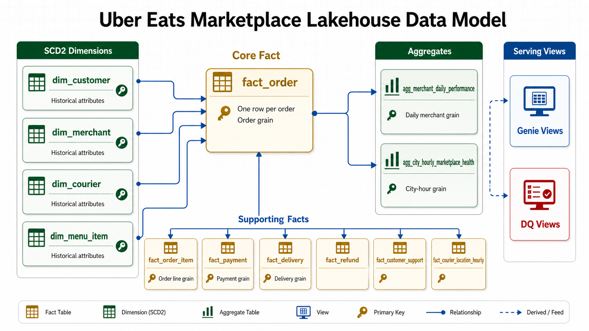

# Uber Eats Marketplace Lakehouse: Project Overview And Business Outcomes

## 1. Executive Summary

This project builds a production-minded data platform for an Uber Eats-style food delivery marketplace on Databricks Free Edition. The platform ingests operational marketplace files, processes them through a bronze-silver-gold lakehouse architecture, enforces data quality, preserves master-data history with SCD Type 2 dimensions, and publishes curated facts, aggregates, and Genie-ready views for business analytics.

The implementation is not affiliated with Uber and does not use proprietary Uber data. It generates realistic synthetic data that follows common food delivery marketplace patterns: orders, payments, merchant snapshots, customer snapshots, courier telemetry, menu changes, refunds, ratings, and support cases.

## 2. Business Context

Food delivery marketplaces operate across customers, merchants, couriers, promotions, payments, and customer support. Data from these systems arrives at different speeds and with different quality guarantees.

Typical business questions include:

- Which cities and merchants drive order volume and gross booking amount?
- Which delivery stages create SLA failures?
- Which courier and merchant patterns correlate with late delivery?
- Which refunds and support tickets indicate poor customer experience?
- Which records failed quality checks, and what source files produced them?
- Can analysts ask natural-language questions over trusted marketplace data?

The platform is designed to answer these questions from governed, optimized, auditable Delta tables.

## 3. Target Outcomes

The project produces these measurable outcomes:

- A governed Unity Catalog layout with separate bronze, silver, gold, data quality, audit, and config areas.
- Incremental file ingestion using Auto Loader.
- Raw append-only bronze tables with file lineage, ingestion timestamps, schema evolution, and rescued data.
- Conformed silver tables with normalized data types and duplicate handling.
- Data quality rule results and record-level quarantine tables.
- Historical customer, merchant, courier, and menu item dimensions using SCD Type 2.
- Gold facts and aggregates aligned to clear analytical grains.
- Delta table optimization with liquid clustering, predictive optimization, and UniForm where the workspace permits.
- Databricks Jobs workflow with retries, re-execution support, and quality gates.
- Databricks Asset Bundle configuration for repeatable deployment.
- GitHub Actions templates for CI validation and bundle deployment.
- Genie-ready curated views and verified SQL examples.

## 4. Why This Domain Is Suitable

The Uber Eats marketplace domain is strong for advanced data platform design because it naturally contains:

- Event streams with late and duplicate records.
- Multi-entity joins across orders, customers, merchants, couriers, and payments.
- High-volume telemetry data.
- Slowly changing master data.
- Revenue and operational facts with different grains.
- Quality rules that matter to financial and operational reporting.
- Failure handling and reprocessing needs.
- Data serving needs for BI and conversational analytics.

The problem is complex enough to discuss architecture deeply while remaining runnable in Databricks Free Edition.

## 5. Source Systems Simulated

The source generator creates daily landing partitions that represent files from different operational systems.

| Source Dataset | Format | Business Meaning |
|---|---:|---|
| orders | JSON Lines | Order lifecycle snapshot with placed, accepted, prepared, pickup, delivery, and status fields |
| order_events | JSON Lines | Event-level order status changes |
| order_items | JSON Lines | Menu items purchased within each order |
| payments | CSV | Payment authorization and capture data |
| refunds | JSON Lines | Refund requests and decisions |
| ratings | JSON Lines | Customer ratings for food and delivery |
| support_tickets | JSON Lines | Customer support interactions |
| courier_locations | JSON Lines | Courier GPS-like telemetry points |
| merchant_snapshots | JSON Lines | Merchant master-data snapshots |
| customer_snapshots | JSON Lines | Customer master-data snapshots |
| courier_snapshots | JSON Lines | Courier master-data snapshots |
| menu_item_snapshots | JSON Lines | Menu catalog snapshots |

The default source volume is 45 daily batches with 1,200 orders per day, producing 54,000 orders plus related records. The order count can be raised through local generator parameters before uploading files to the Unity Catalog landing volume. The default run is publishable; a separate defect-rate parameter can inject critical source issues for recovery testing.

## 6. High-Level Architecture

## 7. Unity Catalog Design

Catalogs:

- `ue_marketplace_lakehouse_dev`
- `ue_marketplace_lakehouse_prod`

Databricks Free Edition uses one physical workspace in this setup. Dev and prod are represented through logical isolation: separate catalogs, separate bundle targets, separate job names, and separate workspace deployment paths.

Schemas:

- `bronze`: raw Auto Loader tables and landing volumes.
- `silver`: standardized and deduplicated operational tables.
- `gold`: facts, dimensions, aggregates, and curated analytical views.
- `dq`: data quality results, failed records, quarantine records, and DQ views.
- `audit`: pipeline run history and watermark control tables.
- `config`: reserved for rule configuration and future environment settings.

Volumes:

- `bronze.landing_volume`: incoming files.
- `bronze.checkpoint_volume`: Auto Loader checkpoints.
- `bronze.schema_volume`: Auto Loader schema tracking.
- `bronze.artifact_volume`: generated artifacts or exported diagnostics.

## 8. Medallion Design

### Bronze

Bronze stores source-aligned records with minimal transformation. It keeps operational lineage and supports reprocessing.

Added metadata:

- `_ingest_ts`
- `_source_file`
- `_source_dataset`
- `_rescued_data`

### Silver

Silver standardizes each dataset into conformed tables. This layer handles:

- timestamp normalization
- decimal casting
- duplicate removal
- schema drift handling
- source-file traceability
- CDC-style snapshot preparation

### Gold

Gold provides dimensional analytics. It contains facts, dimensions, and aggregates that are stable enough for dashboards, Genie, and executive reporting.

## 9. Dimensional Model

Dimensions:

- `dim_customer`: customer history with loyalty tier and marketing preference.
- `dim_merchant`: merchant history with cuisine, commission, tier, and prep-time profile.
- `dim_courier`: courier history with vehicle, activation status, and delivery mode.
- `dim_menu_item`: menu item history with price and availability.
- `dim_city`: city reference.
- `dim_date`: date reference.
- `dim_time`: hour and daypart reference.

Facts:

- `fact_order`: one row per order.
- `fact_order_item`: one row per order line.
- `fact_delivery`: one row per order delivery lifecycle.
- `fact_payment`: one row per payment.
- `fact_refund`: one row per refund.
- `fact_customer_support`: one row per support ticket.
- `fact_courier_location_hourly`: one row per courier per hour.

Aggregates:

- `agg_merchant_daily_performance`
- `agg_city_hourly_marketplace_health`

## 10. SCD Type 2 Strategy

The project uses SCD Type 2 for customer, merchant, courier, and menu item dimensions.

Each dimension includes:

- surrogate key
- natural key
- descriptive attributes
- `valid_from`
- `valid_to`
- `is_current`
- `hash_diff`
- `created_at`
- `updated_at`

The SCD2 process compares incoming snapshot records against the current dimension version. When tracked attributes change, the current record is closed and a new current record is inserted. Facts resolve dimension keys based on event timestamp so historical reporting remains accurate.

## 11. Data Quality Design

Quality checks are implemented with a native Spark SQL rule framework:

- Rule definitions live in Python as SQL statements.
- The DQ notebook executes every rule against silver tables.
- Critical failures stop trusted publication before dimensional modeling starts.
- Warning failures are written for analysis without stopping the workflow.
- Failed records are persisted as JSON payloads in the DQ schema.

Rules include:

- required order keys
- unique order event IDs
- valid order lifecycle timestamp order
- required payment keys
- non-negative payment amounts
- valid payment currency
- positive order item quantities and line totals
- known merchant references
- late delivery warning records
- optional critical source defects for recovery testing

Outputs:

- `dq.dq_rule_results`
- `dq.dq_failed_records`
- `dq.dq_run_summary`

Critical failures stop downstream trusted publication before dimensional modeling starts. Warning failures are recorded for review and are available for Genie analysis. Gold model integrity, such as fact grain uniqueness, is validated inside the gold build step rather than through a separate post-gold DQ gate.

## 12. Failure And Re-Execution Design

The pipeline is idempotent by design:

- Auto Loader checkpoints prevent duplicate file processing.
- Silver tables use merge logic keyed by business identifiers.
- SCD2 merges avoid duplicate active dimension rows.
- Gold facts are rebuilt from trusted silver and dimensions.
- DQ failures persist failed records with rule metadata and source payloads.
- The Databricks workflow can be re-run from a failed task.

Typical failure scenario:

1. A daily order file contains null `order_id` values.
2. Bronze ingestion succeeds because bronze preserves source reality.
3. Silver standardization succeeds and keeps lineage.
4. DQ detects failed required-key rules.
5. Failed records are written to `dq.dq_failed_records`.
6. The workflow stops before trusted gold publication.
7. After source correction or rule decision, the failed task can be re-executed.

## 13. Optimization Strategy

The project applies modern Delta optimization patterns through a separate gold maintenance job:

- Liquid clustering on query-facing gold tables.
- Predictive optimization on managed Unity Catalog tables where permission allows.
- UniForm on selected gold tables for Iceberg-compatible reads.

Selected clustering keys:

- `fact_order`: `order_date`, `city_id`, `merchant_id`
- `fact_delivery`: `delivery_date`, `city_id`, `courier_id`
- `fact_payment`: `payment_date`, `merchant_sk`
- `agg_merchant_daily_performance`: `order_date`, `merchant_id`

The design avoids excessive partitioning. Liquid clustering is better aligned to evolving query patterns and reduces the need for rigid partition decisions.

## 14. Genie Outcome

The project publishes curated views for Genie:

- `gold.vw_marketplace_executive_summary`
- `gold.vw_delivery_sla_analysis`
- `gold.vw_merchant_profitability`
- `dq.vw_failed_record_analysis`
- `dq.vw_dq_rule_trends`

Suggested Genie questions:

- Which city had the lowest SLA success rate over the last seven days?
- Which merchants generated the highest estimated platform commission?
- Which DQ rule produced the most failed records?
- Show failed records from the latest DQ run.
- Which city-hour combinations show high demand and weak delivery performance?

## 15. Evaluation Criteria

The implementation should be evaluated on:

- correctness of medallion flow
- ability to re-run without creating duplicates
- quality rule coverage and quarantine usefulness
- SCD2 history correctness
- clarity of fact grain and dimensional joins
- governance design under Unity Catalog
- appropriateness of optimization choices
- deployability through Databricks Asset Bundles
- explainability of failure and recovery behavior
- ease of analyst consumption through SQL and Genie
